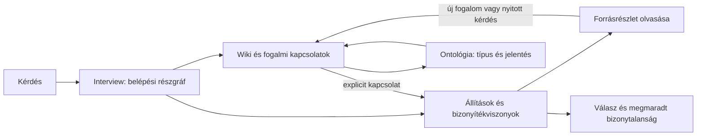

# MCP interview és ontológiai gráfbejárás

**Dátum:** 2026-10-09  
**Állapot:** felhasználói kérésre készített specifikáció; implementáció előtti felülvizsgálatra.  
**Hatókör:** a customBrain meglévő MCP-eszközei mellé kerülő, olvasási célú interview és gráfbejárási hívások.  
**Kiindulás:** a jelen beszélgetés céljai és a helyi customBrain-forráskód ellenőrzése. Az éles környezet teljes állapotát ez a dokumentum nem auditálja.

## 1. Cél és felhasználói probléma

A Brain jelenlegi keresése sok, önmagában releváns gondolatot és dokumentumot adhat vissza, de a találatok együtt túlterhelik az agentet. Az agentnek hosszú szövegekből kell újra megállapítania, mi tartozik össze, melyik rész válaszol a kérdésre, mi egy döntés indoka, és melyik állítást mi támasztja alá. A találatok számának csökkentése önmagában nem oldja meg ezt.

**A bővítés célja, hogy az agent a Brainben kérdésvezérelten tájékozódhasson: először kis, jelentéssel rendelkező részgráfot kapjon, majd maga válassza ki, mit és milyen kapcsolaton keresztül tár fel.** A folyamat során a wiki kapcsolatai, az ontológiai típusok és viszonyok, valamint az állítások bizonyítékkapcsolatai külön-külön és felváltva is használhatók legyenek.

A javulás két részből áll:

- **Mit jár be az agent?** Dokumentumok mellett megkülönböztethető fogalmakat, projekteket, kérdéseket, állításokat, döntéseket és forrásrészleteket; olyan kapcsolatokat, amelyek jelentése ismert.
- **Hogyan járja be?** Tájékozódás → célzott kibontás → forrásellenőrzés → új kérdés vagy másik gráfréteg → válasz. Minden lépést egy még nyitott kérdés indokol.

A kívánt eredmény több hasznos összefüggés és kevesebb egyszerre betöltött szöveg. A keresés továbbra is belépési és újraorientálódási lehetőség; a gráfbejárás nem kötelező kerülőút egy egyszerű dokumentumkereséshez.

**Párhuzamos feltárás:** az agent egymástól független részkérdéseken egyszerre több subagenttel is elindulhat, akár eltérő gráfrétegekben. A cél a hasznos információ gyarapodása közös költségkereten belül: új, releváns és ellenőrizhető megállapítás, feloldott bizonytalanság vagy megtalált ellentmondás. A puszta hívásszám, a sok összefoglaló vagy a rövidebb falióra-idő önmagában nem siker.

### 1.1. Az „interview” jelentése

Ebben a specifikációban **az agent interjúvolja a Braint**: egymást követő, az addigi megfigyelésekből következő kérdésekkel tárja fel a tudást. A Brain strukturált találatokat, részgráfokat, forráshivatkozásokat és lehetséges következő lépéseket ad. Az értelmezést, a következő kérdést és a végső választ a hívó agent készíti.

Ez a beszélgetésből levezetett munkafeltevés. A felhasználó kikérdezése és az új válaszok tudásként történő rögzítése külön funkció: az itt leírt olvasási folyamat nem hoz létre automatikusan új gondolatot vagy bizonyítékkapcsolatot.

### 1.2. Miért ebben a projektben; mi a legkisebb működő kiindulás?

A feladat a meglévő Brain tartalmának agent általi használatát javítja, ezért a jelenlegi MCP felülethez tartozik. A legolcsóbb meglévő megközelítés a `quick_lookup` → `get_thought` korlátozott szövegablakkal, illetve célzott `search_brain` hívásokkal. Ebből a szelektív olvasás már kipróbálható, de a típusos szomszédság, az ontológia megismerése és az állításszintű bizonyítékbejárás hiányzik.

Az új képesség ezt a rést tölti ki. Nem feltételez új repót, külön gráfadatbázist, új hitelesítést, cronfeladatot, szerveroldali autonóm agentet vagy tanuló rangsorolót. Az új gráfok forrásmodelljének és karbantartásának megvalósítása külön függőség, ha ezek még nem állnak rendelkezésre.

## 2. Ellenőrzött jelenlegi állapot

| Meglévő elem | Kódból igazolt működés | Következmény a bővítésre |
|---|---|---|
| `search_brain` | Dense + BM25 hibrid keresés; külön lex/vec részlekérdezések; RRF; evidence címkék | Megmarad. Az új interview használhatja a retrieval alapját, de saját, rövid válaszvetületet készít. |
| Chunk → parent összevonás | A találó chunk mellett a teljes parent `text` is bekerül a válaszba | Az új hívások a releváns egységre és a forráshivatkozásra korlátozzák a kimenetet. |
| `quick_lookup` | Metadata szerinti szűrés, rövid rekordok, teljes szöveg nélkül | Használható entitás/projekt szerinti szűkítéshez. |
| `get_thought` | ID szerinti olvasás, opcionális sorablak; alapból teljes szöveg | Megmarad; az új olvasási hívás minden esetben méretkorlátos. |
| Dossziéindex | People/Projects/Topics/Files/Repos; path, típus, aliasok és szöveg | Wiki- és entitásbelépési pontok alapja. |
| Jelenlegi gráf | `metadata`, `semantic`, `supersedes` élek, közösségek | Önálló legacy asszociációs réteg. Nem tekinthető automatikusan állításszintű bizonyítékgráfnak. |
| Obsidian export | Metadata wikilinkek és szemantikus „Related thoughts” linkek | A link eredetét meg kell őrizni: a generált hasonlósági link nem kézzel megadott ontológiai viszony. |
| MCP-regisztráció | Külön HTTP és stdio regisztráció; közös scope-térkép | Az új hívások mindkét felületen azonos szerződéssel jelennek meg. |

A helyi vizsgálatban nem találtunk külön interview-eszközt, teljes wikilink-bejárási MCP-szerződést, ontológiakatalógust vagy állítás–bizonyíték kapcsolatok olvasási felületét. Ez a helyi checkout állítása; más ágon vagy külön szolgáltatásban létező új gráfokat implementáció előtt fel kell mérni.

A megelőző, 2026-10-08-i beszélgetésben mért illusztráció: `search_brain(query="customBrain search relevance", limit=3)` 16 759 karakteres JSON-szöveget adott. Egy 802 karakteres találó chunk mellett 8 909 karakter parent-szöveg is érkezett. Ez a kimeneti túlterhelés konkrét példája, nem reprezentatív rangsorolási benchmark.

**Fontos:** a jelenlegi `evidence: bm25_exact | high_dense | …` a találat felbukkanását magyarázza. Nem állításigazolás és nem forrásmegbízhatósági minősítés. Az új szerződés ezt `retrieval_signal` néven külön kezeli a bizonyítékviszonyoktól.

## 3. A kívánt használat

Példakérdés: „Miért választottuk ezt a megoldást, és az indok ma is érvényes?”

1. Az agent az `interview_brain` hívással azonosítja a projektet és néhány releváns belépési pontot.
2. Megismeri a rendelkezésre álló csomópont- és kapcsolattípusokat, ha azok még nem szerepelnek a kontextusában.
3. A wiki felől eljut egy döntéshez, vagy közvetlen kereséssel belép a döntésnél.
4. A bizonyítékrétegen megvizsgálja a döntéshez kapcsolt indokot, támogató és ellentmondó forrásokat.
5. Csak a szükséges forrásrészletet olvassa el.
6. A forrásban talált új fogalom vagy alternatíva alapján visszaléphet a wikire, másik ontológiára vagy új keresésre.
7. Megáll, amikor a kérdés megválaszolható, nincs értelmes következő út, vagy elfogyott a feltárási keret. A fennmaradó hiányokat közli.



A diagram fogalmi folyamat. Nem kötelező sorrend és nem szerveroldalon automatikusan lefutó munkafolyamat.

## 4. Gráfrétegek és ontológiák

### 4.1. Rétegek

| Réteg | Mire való? | Milyen következtetést nem enged meg? |
|---|---|---|
| Wiki | Dossziék, fogalmak, projektek, explicit wikilinkek és visszahivatkozások | Egy wikilink önmagában nem támogatás, ok-okozat vagy jóváhagyás. |
| Bizonyíték | Állításokhoz és döntésekhez kapcsolt forrásrészletek; támogatás, ellentmondás, feltétel, eredet | A kapcsolat megléte nem garantálja a forrás igazságát. |
| Ontológiai/fogalmi | Típusok, típusspecializációk, rész–egész és más deklarált szemantikai viszonyok | A típusok hierarchiája nem azonos az egyedi dokumentumok mappahierarchiájával. |
| Legacy asszociáció | Meglévő metadata-egyezés, szemantikus közelség és archiválási lánc | Szemantikus hasonlóságból nem lesz támogatás; archiválásból nem lesz igazolt döntésfelülírás. |

Több wiki-, bizonyíték- vagy szakterületi ontológia is csatlakozhat. Az agent nem feltételez globális, minden gráfban ugyanazt jelentő `related_to` viszonyt. A gráfok és ontológiák saját azonosítót és verziót kapnak; a katalógus megadja a jelentést és a ténylegesen elérhető műveleteket.

### 4.2. Csomópontok: a tartalom egységei

Javasolt közös fogalmak: `thought`, `dossier`, `entity`, `claim`, `decision`, `question`, `source`, `passage`. Egy projekt, személy vagy fogalom az `entity` pontosított típusa lehet. A meglévő adatokat nem kell tömegesen ezekre átminősíteni: a megfeleltetés legyen explicit, a hiányzó állításszintű bontás maradjon hiányként látható.

Minden csomópont rövid nézetének tartalmaznia kell:

- Stabil, a szolgáltató által kiadott `node_ref`; cím és deklarált `type_ref`.
- Gráftagságok; rövid leírás, annak eredete (`stored_summary`, `source_excerpt`, vagy jelölt `generated_summary`).
- Forráshivatkozások, ha rendelkezésre állnak; külön tartalmi és indexelési időpont.
- A forrásban tárolt állapot és ellenőrzési státusz, ha van. Ennek hiányában `unknown`, nem automatikus „aktuális” vagy „ellenőrzött”.
- Az adott kérdéshez tartozó találati indok vagy az odavezető kapcsolat.

A `node_ref` átlátszatlan azonosító: az agent nem gyártja címekből. Egy átnevezés nem hozhat létre látszólag új tudáselemet explicit azonosító-migráció nélkül. A jelenlegi path-alapú dossziéazonosítók átnevezési viselkedése külön integrációs ellenőrzési pont.

### 4.3. Kapcsolatok jelentése és eredete

Minden élhez szükséges: `edge_ref`, `graph_id`, `relation_ref`, `from_ref`, `to_ref`, irányítottság, eredet és a létezését igazoló rekord/forrás hivatkozása. A szimmetrikus viszonyt a séma külön jelzi; a visszafelé bejárás nem fordítja meg a jelentést.

| Példa viszony | Irány és jelentés |
|---|---|
| `wiki:links_to` | oldal → hivatkozott oldal; explicit link |
| `ontology:is_a` | szűkebb típus → tágabb típus; az `instance_of` külön viszony |
| `ontology:part_of` | rész → egész; nem automatikusan `is_a` |
| `knowledge:about` | állítás/gondolat → tárgyalt entitás |
| `evidence:expressed_in` | állítás → forrásrészlet; azt mutatja, hol hangzik el |
| `evidence:supports` | forrásrészlet vagy állítás → támogatott állítás |
| `evidence:contradicts` | forrásrészlet vagy állítás → vitatott állítás; szimmetria csak deklarált sémával |
| `evidence:qualifies` | feltétel vagy forrásrészlet → korlátozott állítás |
| `knowledge:supersedes` | új döntés/állítás → korábbi; csak explicit rögzített értelemben |

Ezek javasolt fogalmi viszonyok, nem a jelenlegi adatbázisban igazolt mezők. A tényleges neveket és engedélyezett végponttípusokat a csatlakozó gráf sémájából kell átvenni vagy dokumentáltan megfeleltetni.

Az él eredete külön adat: például `explicit_wikilink`, `frontmatter`, `stored_assertion`, `human_reviewed`, `model_extracted`, `semantic_similarity`, `legacy_archive_chain`. A modell által felismert és az ember által ellenőrzött viszony nem mosódhat össze. A kapcsolatok számából nem szabad bizonyossági százalékot képezni.

### 4.4. Váltás gráfok között

A váltás közös, igazolt entitásazonosítón vagy explicit hídélen történik. Azonos felirat önmagában nem jogosít összevonásra. A hídnak is meg kell mondania, miért köti össze a két elemet: például „ez a dosszié ezt az entitást írja le”, vagy „ez az állítás ebből az oldalrészletből származik”.

Ha a megfeleltetés többértelmű, jelölt lehetőségek és `ambiguous_reference` állapot érkezzenek. Ha nincs híd, az agent indíthat új keresést, de annak találata nem válhat automatikusan gráfkapcsolattá. Az azonosítók feloldása használja a meglévő aliasokat, az ütközéseket pedig tegye láthatóvá.

## 5. MCP-felület

### 5.1. Kompatibilitás és felelősségek

A `search_brain`, `quick_lookup`, `get_thought` és a többi meglévő hívás neve, bemenete és kimeneti szerződése megmarad. Az új működés új eszközökkel kérhető. A régi keresés kimenetének rövidítését ez a specifikáció nem hajtja végre mellékhatásként.

A szerver feladata a típusos adatok visszaadása, feloldás, szűrés, korlátozás és forráshivatkozás. A hívó agent feladata a kérdés értelmezése, a bejárási stratégia, a következő lépés és a végső szintézis. Az alapváltozat nem igényel új LLM-hívást minden élnél vagy minden interview-lépésnél.

A hívó agent a munkát párhuzamos subagentekre oszthatja, ha ezt a futtatókörnyezete és a feladatra érvényes utasítások lehetővé teszik. A szerver ugyanazokat az olvasási hívásokat szolgálja ki; a delegálás, a közös keret és az eredmények összevonása a hívó oldalon marad. A tool-leírás ezt a használatot ismerteti, nem hoz létre szerveroldali agentfuttatót.

| Új tool | Feladat |
|---|---|
| `get_brain_ontology` | Elérhető gráfok, ontológiák, típusok, kapcsolatok és jelentésük megismerése |
| `interview_brain` | Kérdéshez kötött tájékozódás, belépési részgráf és folytatási lehetőségek |
| `explore_brain` | Egy csomópont közvetlen, típus szerint szűrt környezetének kibontása |
| `get_brain_evidence` | Egy állítás támogató, ellentmondó és korlátozó bizonyítékkapcsolatai |
| `read_brain_node` | Kiválasztott csomópont vagy forrásrészlet korlátos elolvasása |

Mindegyik `brain-read` scope-ot igényel. Nem írnak tudást, nem reindexelnek, és nem nyitnak észrevétlenül élő Gmail/Calendar/Fireflies keresést. A Brainben már tárolt/indexelt forrásokból dolgoznak.

Az `interview_brain` és `explore_brain` MCP-definíciójának `description` szövege tartalmazza a párhuzamos használat lehetőségét és a közös keret követelményét. A `get_brain_evidence` és `read_brain_node` leírása utaljon a már kiosztott források és részletek ismételt betöltésének kerülésére. Beépíthető közös angol szöveg a jelenlegi tool-leírások nyelvéhez igazodva:

```text
When your runtime and task instructions allow subagents, you may explore
independent subquestions in parallel, including across wiki and evidence graphs.
Give each branch a distinct question, scope, and share of one common budget.
Reuse known node references and source excerpts; do not repeat the same broad
search in every branch. Return concise findings with source references,
contradictions, and remaining unknowns. Merge by evidence and meaning, not by
concatenating transcripts. Continue a branch only when it can resolve a useful
open question. These tools read the Brain; they do not spawn subagents themselves.
```

### 5.2. Közös bemenetek és válaszszabályok

**Hivatkozások:** a `node_ref`, `edge_ref`, `graph_id`, `type_ref`, `relation_ref` értékei katalógusból vagy korábbi válaszból származnak. Nem fájlrendszerútvonalak és nem végrehajtható URL-ek.

**Scope:** ahol értelmezett, opcionális `scope` objektum: `project_refs`, `person_refs`, `topic_refs`, `include_archived` (alapból `false`), valamint `as_of` ISO időpont. Az időpont hiánya jelen idejű kérdés, de nem jogosít minden rekord „jelenleg érvényes” besorolására. Ismeretlen érvényességi időt külön kell jelezni; az indexelés időpontja nem helyettesíti azt. Történeti pillanatkép hiányában az `as_of` lekérés lefedettsége korlátozottként jelenjen meg.

**Keret:** opcionális `budget` objektum, szerveroldali plafonnal. Az alábbiak tervezési kezdőértékek, mérés után kalibrálandók:

| Korlát | Alapérték | Felső határ |
|---|---:|---:|
| Teljes visszaadott JSON UTF-8 mérete (`max_response_bytes`) | 12 000 byte | 24 000 byte |
| Csomópontok (`max_nodes`) | 8 | 20 |
| Élek (`max_edges`) | 12 | 40 |
| Következő lépések (`max_next_actions`) | 3 | 5 |

A byte-keret a teljes szerializált alkalmazási válaszra vonatkozik, az összefoglalókkal, példákkal, metaadatokkal és folytatási mezőkkel együtt. A külső MCP-keret méretét az evaluátor külön méri. Egy hívás legfeljebb egy szomszédsági lépést bont ki; nincs rejtett rekurzív teljesgráf-bejárás. A kért értékek validált pozitív egész számok; a hibás vagy határon túli kérés magyarázott hibát kap.

Minden sikeres válasz közös mezői:

- `schema_version`, `status` (`ok`, `partial`, `unavailable`).
- `capabilities_used`: gráfonként a használt ontológiaverzió és az adatverzió, ha a szolgáltató ezt megbízhatóan biztosítja; egyébként `revision_status: unknown`.
- `coverage`: a megvizsgált tartomány, a korlátozás oka, és `complete_for_scope`; teljes Brain-lefedettséget részgráf nem állíthat.
- `next_cursor`, ha van további oldal. A befejezett és a nem támogatott lapozás külön állapot.
- `warnings`: például hiányzó gráf, törött link, ismeretlen érvényesség, feloldatlan alias. Az üres találat nem rejtheti el a szolgáltatóhibát.

A gráfot visszaadó hívások további mezői: `nodes`, `edges`, `next_actions`. Egy él végpontja vagy szerepel a válaszban, vagy rövid, egyértelműen jelölt hivatkozásként azonosítható. A `next_actions` elemei tartalmazzák a tool nevét, valid bemenetét és az adott lépés indokát; nem kötelező végrehajtási utasítások.

**Forrásszerződés:** a `source_refs` elemei legalább `source_ref`, `revision_status`, `locator_status` mezőt tartalmaznak. Ismert verziónál `revision`, pontos horgonynál `locator` is kötelező; ismeretlen vagy nem alkalmazható adatnál ezt a státusz és rövid ok jelzi. A forrás és a lokátor külön azonosítható, így ugyanarra a forrásra több bizonyítékrészlet is mutathat. Az ismeretlen verziójú referencia navigációra használható, de nem állítható be változatlan történeti bizonyítékként.

A v1 illeszkedjen a jelenlegi MCP-kimenethez: egyetlen JSON-dokumentum a szöveges content blokkban. Ugyanaz a teljes részgráf ne jelenjen meg másodszor egy párhuzamos, redundáns szöveges összefoglalóban. Az agent a strukturált mezőket értelmezi.

### 5.3. `get_brain_ontology`

**Bemenet:** opcionális `graph_ids`, `type_refs`, `relation_refs`, `cursor`, `budget`.

**Kimenet:** lapozható gráfkatalógus és a kért sémarészlet. Gráfonként: `graph_id`, réteg, leírás, `availability` (`available`, `partial`, `unavailable`), ontológiaazonosító/verzió, támogatott node/edge típusok és műveletek. Kapcsolatonként: jelentés, irány, végponttípusok, szimmetria/tranzitivitás, ha deklarált, valamint rövid értelmezési példa. Hídkapcsolatok és feloldási korlátok külön szerepelnek.

Alapból a katalógus rövid áttekintése érkezik, nem minden ontológia teljes leírása. A `type_refs`/`relation_refs` szűkíti a részletes definíciókat. A fogalmi szomszédság további bejárása az `explore_brain` hívással történik, ha a szolgáltató ezt támogatja. Az ontológiaverzió változása látható legyen; a kliens korábbi definíciója nem maradhat észrevétlenül érvényesnek tekintve.

### 5.4. `interview_brain`

**Bemenet:** kötelező `question`; opcionális `intent` (`orientation`, `current_state`, `decision_history`, `claim_check`, `connection`), `mode` (`auto`, `wiki`, `evidence`, `mixed`), `scope`, `focus_refs`, `visited_refs`, `budget`.

Alapértelmezés: `intent=orientation`, `mode=auto`. A `focus_refs` legfeljebb három, korábban feloldott csomópont. A `visited_refs` legfeljebb száz hivatkozás; prioritási jelzés, nem olyan kizárás, amely bizonyítékot vagy ellentmondást eltüntethet. A hiányzó állapot üres kezdést jelent.

**Működés:** kiválaszt néhány belépési pontot a rendelkezésre álló keresésből és a gráfokból, rövid nézetben visszaadja azokat, megmutatja a releváns kapcsolatokat és a ténylegesen elérhető folytatásokat. A `mode=auto` a jelzett intent, a focus típusa és a gráfok elérhetősége alapján választ; a `selected_mode` és `selection_reason` megmagyarázza a választást. Nem szükséges rejtett kérdésátíró modell.

Explicit `mode=wiki` vagy `mode=evidence` esetén a kért réteg hiánya `unavailable`; nincs csendes helyettesítés szemantikus kereséssel. `mixed` módban valamely réteg hiánya `partial`, megnevezett hiánnyal. Az `auto` csak elérhető működést választ, és a hiányzó lehetőségeket is jelzi.

**További kimenet:** `question`, `selected_mode`, `selection_reason`, `entry_points` hivatkozások; szükség esetén `clarifications` a többértelmű kérdéshez. A tisztázandó pontokat az agent kezelheti, nem indul automatikus felhasználói kérdezgetés.

Egy következő interview-hívásban az agent módosíthatja a kérdést vagy a fókuszt. Nem kell teljes beszélgetést visszaküldeni. A v1 kliensoldalon vezetett bejárási állapotot használ; nincs tartós szerveroldali interview-session és nincs szükség külön start/finish/storage API-ra.

### 5.5. `explore_brain`

**Bemenet:** kötelező `from_ref`, `graph_id`; opcionális `relation_refs`, `direction` (`out`, `in`, `both`, alapból `both`), `question`, `scope`, `cursor`, `budget`.

**Kimenet:** a kiválasztott gráfban a csomópont egy lépésre lévő szomszédságának korlátos részlete. Típusos élek, rövid csomópontok, elérhető folytatások és lefedettség. Az agent kérhet például bejövő wikilinkeket, `part_of` viszonyt, vagy egy állításhoz vezető kapcsolatokat.

A gráfváltás a katalógusban deklarált híd mentén történik. Ha a `from_ref` az adott gráfban nem értelmezhető és nincs híd, a válasz ezt jelzi; nem próbálja névazonosság alapján kitalálni a megfeleltetést. Nagy fokszámú csomópontnál a kapcsolattípus szerinti összesítés és a lapozás biztosítja a továbblépést. Pontos darabszám csak teljes, igazolt számlálásból adható.

### 5.6. `get_brain_evidence`

**Bemenet:** kötelező `claim_ref`; opcionális `graph_ids`, `relation_refs`, `scope`, `cursor`, `budget`. Alapból minden olyan elérhető bizonyítékgráf érintett, amelyben az állítás közvetlenül vagy igazolt hídon keresztül feloldható, és minden támogatott támogató, ellentmondó és korlátozó viszony szerepel a keresési tartományban. Explicit szűkítés esetén a többi csoport `not_requested`, nem „nincs ilyen bizonyíték”.

**Kimenet:** az állítás rövid nézete, külön `supporting`, `contradicting`, `qualifying` csoportok; az él és a forrás eredete; olvasási hivatkozások; lefedettség viszonytípusonként. A csoportok közös byte-keretet használnak, de egy népes támogató csoport nem szoríthat ki némán minden ellentmondást. A visszatartott csoport és folytatása látható.

A forrást és annak másolatát vagy szintézisét közös eredethez kell kapcsolni, ha ez ismert. Azonos meetingből származó három thought nem három független bizonyíték. Ismeretlen eredet esetén a függetlenség ismeretlen marad. Körkörösen egymásra hivatkozó összefoglalók nem alkotnak új elsődleges bizonyítékot.

Üres csoport jelentése: „a megvizsgált tartományban nincs rögzített ilyen kapcsolat”. Nem jelenti, hogy az állítás igaz, hamis, vagy hogy a teljes Brainben nincs ellenbizonyíték. Nem elérhető bizonyítékgráf esetén `status=unavailable`, nem üres, sikeres bizonyítéklista érkezik.

### 5.7. `read_brain_node`

**Bemenet:** kötelező `node_ref`; opcionális `view` (`summary`, `source_excerpt`, alapból `summary`), `source_ref`, `expected_revision`, `locator`, `cursor`, `budget`.

`source_excerpt` esetén a `source_ref` a korábbi válaszból származik, vagy a `node_ref` maga egy forrás/részlet. A `locator` egy korábban kiadott forráshorgony: a szolgáltató sémájában megadott sorablak vagy pontos karaktertartomány. Tetszőleges fájlútvonal/URL nem adható meg forrásként.

**Kimenet:** korlátos összefoglaló vagy szó szerinti forrásrészlet; forrásazonosító, tényleges tartomány, olvasott tartalomverzió, folytatás. A részletnek meg kell egyeznie az azonosított forrásverzió adott tartományával. A generált chunk vagy összefoglaló nem állítható be szó szerinti idézetként.

A sorlimitet önmagában nem tekintjük méretkorlátnak: egyetlen sor is lehet nagyon hosszú. A byte-keret miatt szükséges részletfolytatás karakterpozíciója pontosan azonosítható legyen, érvényes Unicode-határon. A csonkolás jelölt, és nem veszhet el szöveg a folytatásnál.

Ha `expected_revision` eltér az olvasott verziótól, `source_changed` hiba érkezik az aktuális verzió azonosítójával. Korábbi változat megőrzésének hiányában ezt közölni kell; a rendszer nem adhatja vissza a friss szöveget régi bizonyítékként. A forrásváltozatok tartós archiválása nem ennek az MCP-bővítésnek a rejtett mellékfeladata.

## 6. Példa hívássor

Az alábbi azonosítók szemléltető helykitöltők. Valós használatban mindig az előző válasz hivatkozásait kell továbbadni.

```json
{
  "tool": "interview_brain",
  "arguments": {
    "question": "Miért ezt a keresési megoldást választottuk, és ma is érvényes az indok?",
    "intent": "decision_history",
    "mode": "mixed",
    "budget": { "max_nodes": 5, "max_edges": 8, "max_response_bytes": 12000 }
  }
}
```

A rövid válasz például egy projektoldalt, egy döntést és egy nyitott kérdést azonosít. Megmondja, hogy a wiki és a bizonyítékgráf elérhető-e, és felkínálja a döntéshez vezető kapcsolat kibontását. Nem másolja be a projekt összes meetingjét.

```json
{
  "tool": "explore_brain",
  "arguments": {
    "from_ref": "wiki:w1",
    "graph_id": "brain-wiki",
    "direction": "out",
    "question": "Melyik rögzített döntés kapcsolódik a kereséshez?"
  }
}
```

A feloldott hídon keresztül kapott állítás vagy döntési indok hivatkozásával:

```json
{
  "tool": "get_brain_evidence",
  "arguments": { "claim_ref": "evidence:c1" }
}
```

Az agent a válaszból választ egy forrást, és annak visszaadott lokátorával olvas:

```json
{
  "tool": "read_brain_node",
  "arguments": {
    "node_ref": "source:s1",
    "view": "source_excerpt",
    "expected_revision": "rev-example-1",
    "locator": { "from_line": 12, "max_lines": 8 }
  }
}
```

Ezután visszatérhet a wikihez egy újonnan azonosított fogalommal, vagy új `interview_brain` kérdést indíthat az aktuális állapotról. A szerver egyik ponton sem értelmezi a bejárt útvonalat automatikusan bizonyításként.

## 7. Bejárási szabályok és a túlterhelés megelőzése

1. **Áttekintés a teljes szöveg előtt.** Rövid tartalom, kapcsolatjelentés, forráshivatkozás és folytatási lehetőség alkotja az alapválaszt.
2. **A részgráf kérdésfüggő.** Nem a csomópont teljes kapcsolati környezete és nem a teljes Brain gráfja kerül a kontextusba.
3. **Wiki és bizonyíték váltakozhat.** A váltást új fogalom, hiányzó indok vagy ellenőrzendő állítás indokolja. Nincs kötelező fentről lefelé haladás.
4. **Az agent vezet rövid munkajegyzetet.** Eredeti kérdés, nyitott alkérdések, már olvasott forrásverziók, bejárt hivatkozások és indokolt következő út. Ez az agent munkakontextusa, nem új tartós Brain-adat.
5. **Ciklus és ismétlés kezelése.** A visszatérő csomópontot az agent felismeri; csak új kérdés, új kapcsolat vagy változott forrás miatt olvassa újra. A szerver egy lépést ad, így nem indulhat végtelen rekurzió.
6. **Megállási feltétel.** Elég bizonyíték a kérdéshez; nincs hasznos új ág; vagy elfogyott a kliensoldali hívás-/kontextuskeret. A keret végét nem szabad sikeres bizonyításnak nevezni.
7. **Kijárat a gráfból.** Széttagolt vagy hiányos gráfnál új keresés megengedett. Hiányzó élből nem következik hiányzó tudás.

A kiinduló kliensstratégia legfeljebb nyolc feltáró/olvasó MCP-hívást engedjen egy körben, a főagent és minden subagent hívásait együtt számolva, utána értékelje újra a nyitott kérdéseket. Ez javasolt kontroll, nem szolgáltatói időzítés vagy hibát elfedő retry. A teljes kör kimeneti méretét is mérni kell: sok kicsi válasz együtt ugyanúgy túlterhelhet.

### 7.1. Párhuzamos ágak: külön feladat, közös keret

Párhuzamos ág akkor indokolt, ha a részkérdések már megfogalmazhatók, és nem várnak egymás eredményére. Ha az induló kérdés eleve független részekre bontható, a delegálás a kezdéskor is történhet. Ha előbb azonosítani kell egy döntést, azt a közös tájékozódó lépés oldja fel; a döntés még ismeretlen hivatkozására épülő bizonyítékkeresés addig függő feladat.

Példa a már feloldott döntés vizsgálatára:

| Ág | Részkérdés | Elsődleges út |
|---|---|---|
| A | Milyen alternatívákat és korlátokat rögzítettünk? | Wiki, döntéstörténet, ontológiai kapcsolatok |
| B | Mi támasztja alá vagy cáfolja az indok mai érvényességét? | Bizonyítékgráf, dátumok, célzott forrásolvasás |

Mindkét ág válthat gráfréteget, ha a saját részkérdése ezt indokolja. A feladatmegosztás kérdés szerint történik; nem kell minden agentet egyetlen gráfba zárni. Egyszerű lookuphoz a subagentindítás többlete nem indokolt.

A főagent feladata:

- Kezdő ajánlásként legfeljebb két párhuzamos ágat indít; ez kalibrálható kliensstratégia, nem MCP-protokollkorlát.
- Minden ágnak konkrét részkérdést, fókuszhivatkozásokat, stopfeltételt és a közös keretből előre elkülönített részt ad. Csak a szükséges kontextust adja át, nem automatikusan a teljes beszélgetést és az összes forrást.
- Közös, rövid munkajegyzetben követi a kiosztott feladatokat, lefoglalt forrásrészleteket, már olvasott verziókat és új eredményeket. Ehhez a v1 nem kér új tartós tárolást.
- A keretet a párhuzamos indítás előtt osztja fel. A nyolc hívás nem lesz áganként nyolc; a főagent saját további olvasásai és az összevonás modellköltsége is része a teljes munkának. További delegálás nem sokszorozhatja meg a keretet hallgatólagosan.
- A cél teljesülésekor nem indít további ágakat; az aktív ágakat lezárja, ha a futtatókörnyezet ezt támogatja. A már elköltött tokeneket ettől még elszámolja.

A szerver az egyes MCP-válaszok korlátját tudja kikényszeríteni. Az összes subagent modelltokenjét és a teljes munkakeretet a hívó futtatókörnyezet követi; a jelenlegi stateless MCP nem állíthatja, hogy ezt globálisan ellenőrzi. Ha tényleges tokenadat nem érhető el, a mért byte/hívásszám és a jelölt tokenbecslés külön szerepeljen, ne kitalált pontos költség.

### 7.2. Mit adjon vissza egy ág?

A subagent eredménye rövid bizonyítékcsomag legyen: `subquestion`, `findings`, `contradictions`, `unknowns`, `coverage`, `usage`. Minden érdemi `finding` tartalmazza a megállapítást, a node/edge hivatkozásokat, a forrás verzióját és lokátorát, ha ismert, valamint azt, hogy közvetlen forrásállítás vagy az agent következtetése. A `usage` a mért hívás-, byte- és elérhető tokenadatot tartalmazza; a hiányzó mérés jelölt. Ez kliensoldali delegálási eredményforma, nem új MCP-tool.

Az összevonás jelentés és forrás alapján történik. Ugyanazt a részletet nem kell újra bemásolni minden ágból. Ugyanazon forrás eltérő, releváns részleteit viszont meg kell őrizni; az eltérő vagy ellentmondó állítások nem tűnhetnek el egyszerű duplikátumszűrésben. Közös forrásra támaszkodó két subagent egyetértése nem független bizonyíték.

Egy újabb lépés indoka legyen megnevezhető: melyik nyitott kérdést oldhatja fel, milyen ellenbizonyítékot ellenőrizhet vagy milyen releváns hiányt pótolhat. A csak ismétlést hozó ág megáll. Kritikus állítás célzott, független ellenőrzése akkor is lehet hasznos, ha nem új témát hoz; ezt ellenőrzésként kell értékelni.

## 8. Adatfüggőségek és integráció

| Képesség | Meglévő alap | Szükséges kiegészítés vagy igazolás |
|---|---|---|
| Interview belépési pontok | Hibrid keresés, dossziék | Korlátos vetület, típustudatos csoportosítás, katalógus |
| Wiki szomszédság | Dossziészöveg, exportált wikilinkek, aliasok | Explicit linkek és eredetük feloldható szomszédsági olvasása, bejövő linkek lefedettsége |
| Ontológiai bejárás | Néhány meglévő rekordtípus és metadata mező | Séma/katalógus és a deklarált fogalmi viszonyok szolgáltatója |
| Bizonyítékbejárás | Thoughtok, források és chunkok | Állításazonosítók, típusos bizonyítékélek, forráshorgonyok, eredet és állapot |
| Rétegváltás | Dossziék és aliasok | Igazolt entitásazonosság vagy explicit hídélek |
| Pontos forrásolvasás | `getThoughtSlice` | Byte-keret, pontos folytatás, verzióellenőrzés és generált/eredeti szöveg különbsége |

A hiányzó gráfok tartalmát nem szabad keresési hasonlóságból helyettesíteni. A prototípus adhat `partial` képességet, de a teljes feature csak akkor tekinthető késznek, ha a wiki- és bizonyítékbejárás, illetve a kettő közötti váltás valós, forrásra mutató kapcsolatokkal működik.

### 8.1. Tárolás és olvasás

Az MCP vékony olvasási réteg legyen a már meglévő vagy külön fejlesztett gráfforrások felett. A konkrét indexelési és tárolási megoldást csak a tényleges gráfszolgáltatók felmérése után kell rögzíteni. Ha egy szükséges kapcsolat csak forrásszövegben létezik, azt explicit adatfüggőségként kell kezelni, nem minden lekérésben rejtett teljes-korpusz-LLM-feldolgozással pótolni.

A jelenlegi `buildGraph()` teljes vektorkészletet olvas és páronként hasonlít. Ezt nem szabad minden interview-lépésnél teljes egészében lefuttatni. Az új olvasási út korlátos szomszédsági hozzáférést igényel. Ha ehhez új tartós index kellene, annak igénye és költsége külön implementációs döntés, nem ennek a dokumentumnak hallgatólagos felhatalmazása.

### 8.2. Lapozás és változó adatok

A növekvő adathalmazok olvasása lapozott; nincs csendes, körülbelül ezer rekordnál történő levágás. A pontos számlálás külön művelet. A top-N korlátot és a teljes bejárást nem szabad összekeverni.

A cursor a szűrőkhöz, irányhoz, sorrendhez, gráfhoz és annak megbízható revíziójához kötött. Rendezésnél egyedi stabil azonosító a végső tiebreaker; a folytatás kulcsalapú vagy a szolgáltató stabil cursorát használja. Revízióváltásnál `cursor_stale` állapot és explicit újraindítás szükséges. Ha a szolgáltató nem kínál snapshotot/revíziót, a válasz `consistency: best_effort`, és nem ígér teljes, változatlan pillanatképet. Erős konzisztenciát nem szabad pusztán időbélyegből állítani.

### 8.3. Wikilinkek és források

A feloldás megkülönbözteti a link célját és megjelenített aliasát, a fejezet-/blokk-horgonyokat és a hiányzó célokat. Az olyan konstrukciók, mint `[[Projects/X|X]]`, nem hozhatnak létre két entitást. Két azonos című oldal nem vonható össze mappa/azonosító figyelmen kívül hagyásával. A generált „Related thoughts” szakasz linkjei megőrzik szemantikus eredetüket.

A keresés által visszahozott dossziéknál az új út megőrzi a típust, path/azonosságot és forrásadatot; nem hagyatkozik kizárólag a jelenlegi, egyes mezőket elhagyó search-kimenetre. A jelenlegi generált chunkok nem garantált eredeti forrástartományok: idézhető horgony csak ellenőrzött megfeleltetésből készülhet.

## 9. Hibák, hiányok és hozzáférés

Validációs/szerződéshibák `isError=true` MCP-választ kapnak rövid `error: {code, message, details}` objektummal; a `details` csak a továbblépéshez szükséges mezőket tartalmazza. Elvárt adatkorlátok, például egy nem telepített bizonyítékgráf, normál `status=unavailable` választ kapnak. Több forrásból összeálló válasznál egy sikertelen szolgáltató miatt `partial` státusz és név szerint jelzett hiány szükséges.

Javasolt hibakódok: `invalid_reference`, `ambiguous_reference`, `unsupported_relation`, `source_changed`, `source_unavailable`, `cursor_stale`, `budget_too_small`. A `budget_too_small` akkor is használható, ha a minimális kötelező metaadat sem fér el; hibánál nem kell a felhasználó által irreálisan kicsire kért keretet teljesíteni, de a hiba is maradjon rövid.

Az új toolok bekerülnek a `TOOL_SCOPES` térképbe, a HTTP és stdio regisztrációba. A hivatkozás/cursor nem jogosultság: minden olvasás a hívó aktuális hozzáférésével történik. A meglévő jogosultsági modellt nem bővítjük új auth-folyamattal. A forrásszöveg és wikilink adat, nem végrehajtandó utasítás; az interview nem indít capture-t vagy más írást a beolvasott tartalom hatására.

## 10. Elfogadási feltételek

| Eset | Elvárt eredmény |
|---|---|
| Régi kliens hívja a `search_brain`-t | Ugyanaz a szerződés és viselkedés; az új toolok hozzáadása nem töri el. |
| Hosszú meeting egyik részlete releváns | Interview/explore nem adja vissza a teljes meetinget; a kiválasztott rész külön olvasható. |
| Wiki → állítás → bizonyíték → wiki | Az agent explicit hivatkozásokkal vált, a kapcsolatok jelentése és eredete megmarad. |
| Két ontológiában azonos nevű reláció | A `relation_ref` és ontológiaverzió megkülönbözteti őket. |
| Szemantikus szomszéd vagy generált wikilink | Asszociációként jelenik meg, nem állítástámogatásként. |
| Támogató és ellentmondó forrás egyszerre | Mindkét oldal látható vagy explicit folytatás mutat rá; a támogatás nem rejti el az ellentmondást. |
| Ugyanazon forrás több másolata | Eredetük szerint csoportosítható; nem állítható több független bizonyíték. |
| Nincs bizonyítékgráf / szolgáltatóhiba | `unavailable` / `partial`; nem üres, sikeres bizonyítéklista. |
| Kör, nagy fokszám, ismétlődő csomópont | Egy lépés, korlátos válasz, értelmes folytatás; nincs teljesgráf-kibontás. |
| Több mint ezer szomszéd | Stabil adatok mellett teljes, ismétlés- és kihagyásmentes lapozás. Változásnál jelzett konzisztenciahatár. |
| Törött/azonos nevű/aliasos wikilink | Nem talál ki célt; feloldott, többértelmű vagy hiányzó állapotot ad. |
| Forrás változik a két lépés között | A régi lokátor nem igazolhat észrevétlenül új szöveget; verzióütközés látható. |
| Egyetlen rendkívül hosszú sor | A byte-keret és pontos folytatás érvényes marad. |
| Historikus kérdés | Nem lesz egy régi döntés irreleváns csak azért, mert régi; hiányzó történeti verzió jelölt. |
| Scope nélküli token / közvetlen toolhívás | A meglévő scope-kapuval egyező tiltás mindkét MCP-regisztrációban. |
| Független részkérdések párhuzamos ágakon | Eltérő feladat és elkülönített részkeret; a főagent és az ágak egy közös teljes keretet használnak. |
| Két ág ugyanarra a forrásra jut | Az azonos részlet összevonható; a különböző megállapítás és ellentmondás megmarad; az egyetértés nem lesz több bizonyíték. |
| Nincs új hasznos információ / elfogy a közös keret | Az ág megáll, lefedettségét és hiányait visszaadja; nincs automatikus újabb fan-out. |
| Nincs subagent-képesség a kliensben | Ugyanazokkal a toolokkal soros feltárás működik; a szerver nem vár agentfuttatót. |

### 10.1. Minőségmérés

A meglévő `scripts/prove-brain.js` és korábbi evaluator kérdései adják az összehasonlítás alapját. A mérés a teljes agent-folyamatot hasonlítsa össze: régi keresés + szükséges olvasások versus interview + bejárás + olvasások. Azonos korpusz, kérdések és hívómodell mellett kell mérni, nem csak az első tool-választ.

Mérendő: emberileg megítélt válaszhelyesség; releváns bizonyíték elérése; idézhető források pontossága; észlelt ellentmondások; teljes MCP-kimeneti byte és – ha mérhető – token; hívásszám; teljes idő; feloldatlan kérdések. Egy rövidebb, de téves vagy hiányos válasz nem javulás.

A soros és a párhuzamos interview külön összehasonlítandó. A költség a főagent és az összes subagent bemeneti/kimeneti tokenjét, az átadott kontextus másolatait, a szolgáltató által jelentett további tokenkategóriákat, a tool-eredményeket, az összevonást és az esetleges szerveroldali modellhívásokat is lefedi. Ha a tool-szöveg már szerepel egy modell bemeneti tokenelszámolásában, nem szabad azt másodszor hozzáadni; a byte-mérés külön diagnosztikai mutató.

A „hasznos token” itt minőségi cél: több releváns, forrással alátámasztott és nem ismétlődő megállapítás, feloldott kérdés vagy ellenőrzött ellentmondás ugyanakkora teljes költség mellett. A mérés rögzítse a már olvasott forrásrészletek újraolvasási arányát és az ágakból ténylegesen felhasznált megállapításokat is. A pusztán gyorsabb, de drágább párhuzamos futást időnyereségként kell bemutatni; tokenhatékonysági javulás csak a teljes elszámolás alapján állítható. A subagentek hosszú szövegének a főagent elől való elrejtése önmagában nem költségcsökkentés.

Javasolt elfogadási cél az előre kiválasztott túlterhelő kérdéseken: legalább fele akkora medián teljes tool-kimenet, romló válaszhelyesség és romló ellentmondás-felismerés nélkül. Ez célérték, nem már mért eredmény. Az egyszerű lookup és a valóban hiányzó válasz kontrollesetként maradjon a kérdéssorban. Nem indul automatikus tanuló/rangsoroló visszacsatolás.

## 11. Megvalósítási sorrend és döntési határok

1. **Gráfforrások leltára és szerződése.** Pontosan melyik wiki, bizonyítékgráf és ontológia létezik; azonosítók, hídélek, forráshorgonyok, revíziók és olvasási lehetőségek. Hiány esetén külön adat-előfeltétel rögzítendő.
2. **Korlátos olvasási alap.** Rövid csomópontnézet, forrásolvasás, keretek, lapozás és katalógus. A régi search kompatibilitását külön ellenőrizni kell.
3. **Típusos bejárás és bizonyítékok.** `explore_brain`, `get_brain_evidence`, wiki–bizonyíték átjárás valós kapcsolatokkal.
4. **Interview belépési felület.** A korábbi képességeket rövid, kérdéshez kötött részgráffá és lehetséges folytatásokká állítja össze.
5. **Valós kérdéses összehasonlítás.** A teljes kör mérete, pontossága és használhatósága alapján döntés a kiadásról.

A 2. lépés prototípusa önmagában nem teljesíti a wiki- és bizonyítékbejárás célját. A 3–4. lépés nem helyettesítheti az 1. lépésben hiányzónak talált adatot kitalált kapcsolatokkal.

Az implementáció várható kapcsolódási pontjai: `server/mcp.js`, `server/mcp-stdio.js`, `server/mcp-scopes.js`, a keresési és forrásolvasási modulok, valamint a tényleges gráfszolgáltatók. Közös üzleti logika a két MCP-regisztráció mögött; általános MCP-refaktor, új UI és teljes adatmodell-átépítés nem előfeltétel.

## 12. Felülvizsgálat és nyitott integrációs kérdések

- Az interview munkadefiníciója: agent → Brain feltárás. A felhasználó interjúztatása nincs beleértve.
- Az új bizonyíték- és wikigráf konkrét forrása/verziója a helyi checkoutból még nem állapítható meg. A tool-szerződés ezek csatlakozását írja le, nem állítja, hogy már kész vannak.
- Állításszintű azonosítók, pontos forráshorgonyok és hiteles gráfközi megfeleltetések nélkül a teljes feature nem jelenthető késznek.
- A válaszkeretek és a minőségi célértékek specifikációs kezdőértékek; a kérdésbankon ellenőrizendők.
- A párhuzamos subagentes használat a hívó kliens képessége; az MCP-leírás támogatja és közös kerethez köti. A költségmérés minden ágat és az összevonást is tartalmazza.
- A dokumentum elkészítése nem jelent automatikus capture-t, kódmódosítást, reindexelést vagy deployt.

**Dokumentációs review:** a jelenlegi kódban igazolt és a javasolt képességek elkülönülnek; a régi keresés kompatibilitása explicit; a wiki-/bizonyíték-/ontológiai váltás, részleges lefedettség és forrásellenőrzés saját követelményt kapott.

**Verziójavaslat:** csak ennek a dokumentációnak a kiadására `0.44.0 → 0.44.1` patch; az új MCP-funkció későbbi kiadására az akkori verzióból minor. A specifikáció nem módosít verziófájlokat. A helyi CHANGELOG szerint jelenleg a root `package.json` és az extension manifest hordoz kiadási verziót; a régebbi AGENTS.md négyfájlos leírását implementációkor a tényleges csomagokkal kell egyeztetni.

## 13. Ellenőrzött helyi források

- [MCP HTTP regisztráció](../server/mcp.js), [MCP stdio regisztráció](../server/mcp-stdio.js), [scope-térkép](../server/mcp-scopes.js).
- [Keresés és parent-rollup](../server/routes/search.js), [metadata lookup](../server/quick-lookup.js), [szeletelt olvasás](../server/routes/recent.js).
- [Jelenlegi gráf](../server/routes/graph.js), [Obsidian export és generált wikilinkek](../server/routes/export.js).
- [Dossziéindex](../server/dossier-index.js), [Drive/alias és dossziéolvasás](../server/drive-context.js).
- [Meglévő mérési harness](../scripts/prove-brain.js), [korábbi evaluator](../tasks/evaluator/baseline-findings-2026-07-18.md).
- [Korábbi rendszerértékelés](custombrain-tanulmany-2026-09-12.md), [szakmai memória tervezési előzmény](professional-life-upgrade-detailed.md), [ROADMAP](../ROADMAP.md), [CHANGELOG](../CHANGELOG.md).
